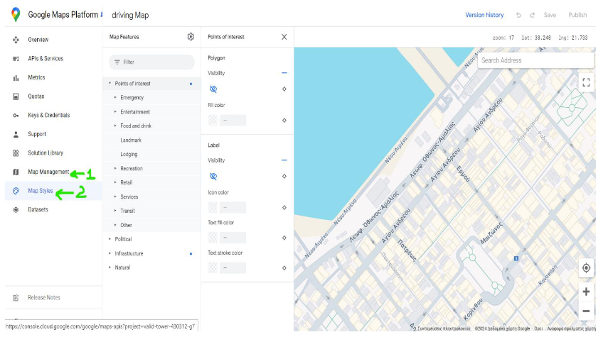

# Smart City Parking

## Google Maps API Keys

### API Key

Αρχικά χρειάζεται ένα API key που βγαίνει από την google.

Το API key συμπληρώνεται στο αρχείο public->js->mapScript.js όπως φαίνεται παρακάτω.

### Map Id

Το mapId βγαίνει και αυτό από τη google και περιορίζεται μόνο σε ένα API για αυτό χρειάζεται να
συμπληρωθεί και αυτό. Το Map Id βγαίνει στην καρτέλα Map Management και μπορεί να μπει και
ένα Style στο Map Styles. Εγώ είχα διαλέξει ένα απλό style και είχα απενεργοποιήσει τα Points of interest.

### Usage

Πατώντας πάνω σε μία θέση parking εντοπίζει την τωρινή τοποθεσία και εμφανίζει την διαδρομή. Για να γίνει αυτό χρησιμοποιείται το navigator.geolocation api του browser. Αυτό ελέγχει αυτόματα την θέση με βάση το gps αν είναι διαθέσιμο ή τη διεύθυνση ip με λιγότερη ακρίβεια αν δεν είναι διαθέσιμο.

Για να λειτουργεί το navigator.geolocation api πρέπει η σύνδεση να είναι https. Για αυτό χρειάζονται τα πιστοποιητικά ασφαλείας. Αυτά πρέπει να είναι μέσα στο φάκελο certificates

Για να φορτώσει η εφαρμογή στο κινητό από το local host υπάρχει [αυτό το βίντεο](https://www.youtube.com/watch?v=sWu2P4IxO64) που τα εξηγεί πολύ καλά  . Το url μετά για να ανοίξει η εφαρμογή είναι IPV4Αddress:8080.

Για να τρέξει η προσομοίωση πρέπει να τρέχουν ταυτόχρονα τα  προγράμματα Iot_Agent.py, simulate.py και ο server
